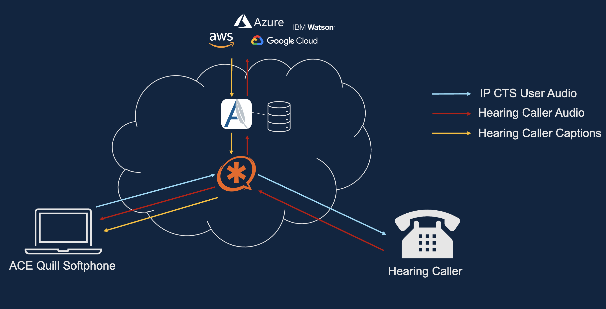
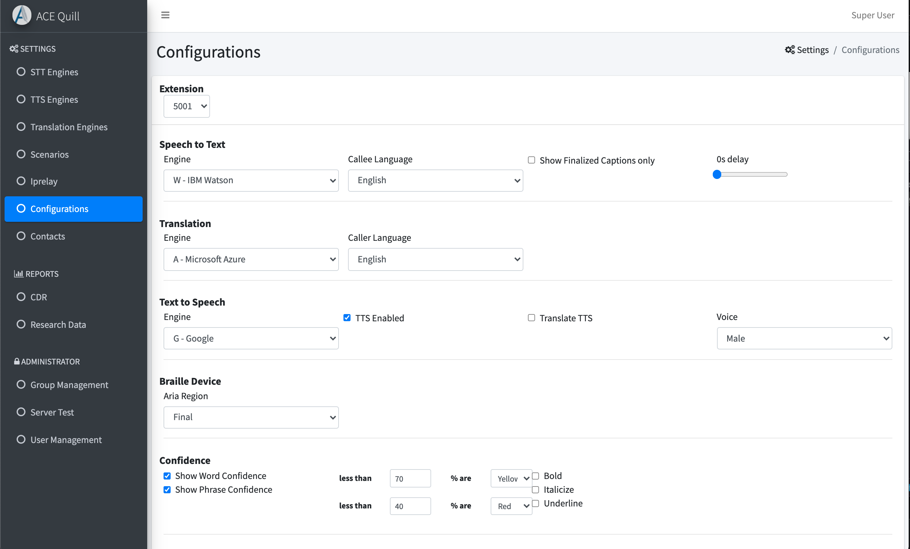
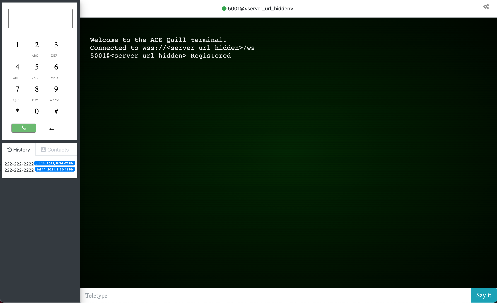

# ACE Quill

ACE Quill is a software prototype that provides Automatic Speech Recognition (ASR) captioning, translation, and Text-to-Speech capabilities from Amazon, Google, IBM Watson and Azure. It was developed to enable evaluations of ASR engine captioning performance for IP CTS devices and help identify potential use in new or existing services for the deaf and Hard of Hearing communities.



ACE Quill was developed using Amazon Web Services (AWS) on a CentOS 7.4 Linux instance running on a t2.medium Elastic Compute Cloud (EC2) instance. A local server could also be used, the CentOS Linux installation instructions can be found on the [CentOS](https://www.centos.org) website. ACE Quill uses [Asterisk](https://www.asterisk.org) to perform calls to the public switched telephone network (PSTN).

ACE Quill is composed of two main components:
1. ACE Quill Terminal - Provides a user with a browser based captioned phone device, capable of performing Speech-to-Text (STT), Text-to-Speech (TTS), and translation. 
1. ACE Quill Research Portal - Provides a web-based interface for researchers and administrators to configure the ACE Quill Terminal and review research data collected from phone calls.


## Installation

## Preinstallation Server Requirements
Install dependent packages:

```
sudo yum install unixODBC unixODBC-devel libtool-ltdl libtool-ltdl-devel
mysql-connector-odbc python3-devel git libevent-devel
```

Install [Node.js](https://nodejs.org/en/) version 14.19.3 
```
curl -sL https://rpm.nodesource.com/setup_14.x | sudo bash -
sudo yum install nodejs
node --version
```

## ACE Quill Software Installation
Clone the ACE Quill repository:
```
git clone https://github.com/FCC/ace_quill/ace_quill_server.git`
```
Type
```
cd ace-quill
```
Install the required Node.js modules: from the ace-quill directory, run
```
npm install
```
Build ACE Quill: from the ace-quill directory, run
```
npm run build
```
Install [PM2](https://www.npmjs.com/package/pm2) >= v4.5.6 by running
```
npm install -g pm2
```


### MySQL Database
This section provides an overview of the MySQL server along with installation and setup documentation.

#### Local Installation (Optional, remote database supported)


Download the Yum repository configuration file:

```
wget https://dev.mysql.com/get/mysql57-community-release-el7-9.noarch.rpm
```

Install the Yum repository configuration file:

```
sudo rpm -ivh mysql57-community-release-el7-9.noarch.rpm
```

Install the MySQL server:

```
sudo yum install mysql-server
```

Start the MySQL server:

```
sudo systemctl start mysqld
```

A temporary password is generated as part of the installation process. It is in the mysqld.log file and can be found with this command:

```
sudo grep 'temporary password' /var/log/mysqld.log
```

MySQL includes a security script to change some of the default, non-secure options:

```
sudo mysql_secure_installation
```

As part of the security script, the user will be prompted for a new password. The new password must be at least 12-characters and contain at least one uppercase letter, one lowercase letter, one number and once special character.

To stop the MySQL server:

```
sudo systemctl stop mysqld
```


#### Configuration
The ACE Quill prototype requires the user to create two MySQL databases and user accounts.

Enter the MySQL shell, enter the root password when prompted:

```
mysql -uroot -p
```

Inside the MySQL shell, create the following databases and accounts for access:

```
mysql> create database asterisk;
mysql> create database ace_quill;
```

Create the database accounts and issue the account grant statements:

```
mysql> grant all on asterisk.* to 'ace_quill'@'localhost' identified by 'password here';

mysql> grant all on ace_quill.* to 'ace_quill'@'localhost' identified by 'password here';
```

Exit the MySQL shell:

```
mysql> exit;
```

The next step is to instantiate the databases. The asterisk_schema.txt and ace_quill_schema.txt files are included as part of the public release download.

From the command prompt (not the MySQL prompt) type the following and enter the password when prompted:

```
cd ~/ace-quill/resources/asterisk
mysql -uace_quill -p asterisk < asterisk.sql`

cd ~/ace-quill
mysql -uace_quill -p ace_quill < ace_quill.sql`
```
*NOTE: If using a remote database specify the host -h*

### Asterisk
See [Asterisk README](./resources/asterisk/README.md) for instructions for Asterisk installation and configuration.

### NGINX

If ACE Quill is behind an NGINX reverse proxy, NGINX will require a subfilter to be enabled. Below is an example of an NGINX location block for the ACE Quill server. In this example the ACE Quill server would be accessed using a web browser at the following URL:

`https://<nginx-fqdn>/ACEQuill/terminal`

The NGINX location block will be added to the NGINX config file which is
usually located in /etc/nginx/nginx.conf.

```
  location /ACEQuill {
    proxy_pass https://acequillserverip:port/;
    proxy_http_version 1.1;
    proxy_set_header Upgrade $http_upgrade;
    proxy_set_header Connection 'upgrade';
    proxy_set_header Host $host;
    proxy_cache_bypass $http_upgrade;

    sub_filter_once off;
    sub_filter 'href="/' 'href="/ACEQuill/';
    sub_filter "href='/" "href='/ACEQuill/";
    sub_filter 'src="/' 'src="/ACEQuill/';
    sub_filter "src='/" "src='/ACEQuill/";
    sub_filter 'path:"/socket.io"' 'path:"/ACEQuill/socket.io"';
    sub_filter "path:'/socket.io'" "path:'/ACEQuill/socket.io'";

    proxy_redirect https://acequillserverip:port/ACEQuill/ /ACEQuill/;
  }
```


###	Server Software Configuration
The `config` directory contains a file named acequill.json_TEMPLATE that contains all of the configuration parameters used by the server. Copy the TEMPLATE file and rename it to `acequill.json`. The configuration parameters and their definitions are shown below.

|Parameter | Data Type | Example | Definition  |
| ------------- |---------| --------|-------------|
| cleartext     | Boolean | "true" | Indicates if configs are encoded in Base64 or plain text |
| debuglevel      | ALL<br>TRACE<br>DEBUG<br>INFO<br>WARN<br>ERROR<br>FATAL<br>OFF | "ERROR" | The debug level for the logger |
| sttService | Enabled<br>Disabled | "enabled" | Toggles speech to text services on or off|
| port | Number | "3000" | Listen TCP port for the server|
| version | Number | "1.0" | The version of the service, appears in the footer of the website|
| nginxlocation | location from nginx | "/ACEQuill" | The location directive within NGINX server block allows to route request to correct location within the file system|
| proxy | URL or IP address | "http://127.0.0.1:8442" | Server proxy - if not required set it to empty quotes ""|
| ssl > key | File path | "/etc/ssl/keys/server.key" | The path to the SSL key|
| ssl > cert | File path | "/etc/ssl/certs/server.crt" | The path to the SSL certificate|
| session > name | String | "acequillsession" | Name used to identify the session|
| session > secret | String | "SecretPhrase123%" | Password used by the session|
| transcriptFilePath | File path | "/tmp/transcripts/" | The path to the directory that will contain the transcript files|
| wavFilePath | File path | "/tmp/wavFiles/" | The path to the directory that will contain the WAV files|
| videoFilePath | File path | "/tmp/videoUploads/" | The path to the directory that will contain the video file uploads|
| mysql > host | IP address | "localhost" | The MySQL hostname or IP address for the database server|
| mysql > user | String | "acequillUser" | MySQL username for the acequill user|
| mysql > password | String | "MyFakePW123%" | The MySQL password for the acequill user|
| mysql > database | String | "acequill" | Name of the database used to store the ACE Quill data|
| asterisk > port | Number | "5038" | The Asterisk manager port, defaults to 5038|
| asterisk > host | IP address | "127.0.0.1" | Asterisk hostname <br> Note that Asterisk must reside on the same Linux instance as the ACE Quill server|
| asterisk > user | String | "asteriskAQ" | The Asterisk username for authentication |
| asterisk > password | String | "AQaccount123%" | Asterisk password for the Asterisk username|
| accuracy > ace2_repo | String | "https://github.com/YOUR-USERNAME/YOUR-REPOSITORY%" | Repository for the ACE2 library|
| accuracy > ace2 | Boolean | "false" | Use the ACE 2 accuracy library|
| accuracy > sclite | Boolean | "true" | Use the SCLite accuracy library|
| accuracy > jiwer | Boolean | "true" | Use the Jiwer accuracy library|

The following is an sample of a valid config/acequill.json file:

```json
{
    "cleartext": "true",
    "debuglevel": "ERROR",
    "port": "3000",
    "version": "1.0",
    "sttService": "enabled",
    "nginxlocation":"/ACEQuill",
    "proxy":"http://127.0.0.1:8442",
    "ssl" : {
      "key": "/etc/ssl/keys/server.key",
      "cert": "/etc/ssl/certs/server.crt"
    },
    "session": {
      "name":"acequillsession",
      "secret": "SecretPhrase123%"
    },
    "transcriptFilePath": "/tmp/transcripts/",
    "wavFilePath": "/tmp/wavFiles/",
    "videoFilePath":"/tmp/videoUploads/",
    "mysql": {
      "host": "localhost",
      "user": "acequillUser",
      "password": "MyFakePW123%",
      "database": "acequill"
    },
    "asterisk": {
      "port": 5038,
      "host": "127.0.0.1",
      "user": "asteriskAQ",
      "password": "AQaccount123%"
    },
    "accuracy" {
      "ace2_repo":"https://github.com/YOUR-USERNAME/YOUR-REPOSITORY",
      "ace2": "false",
      "sclite": "true",
      "jiwer": "true"
    }
}
```

## Starting the Server
To start the ACE Quill:
* From command line: Run `npm start` or `node bin/www`
* From PM2: `pm2 start process.json`
  - To keep ACE Quill running after reboots: `pm2 startup` then follow instructions in terminal.


## ACE Quill Researcher Site


### Accessing the Researcher Site
1. ACE Quill Admin, go to: https://host/nginxPath/admin
1. First time access, prompt to create Admin Account (https://host/nginxPath/admin/firsttimesetup)

## STT, TTS, & Translation Engine Configuration
ACE Quill interfaces with cognitive services from Amazon, Azure, Google, & Watson. Service accounts will need to be created for each service provider. Follow the instructions on the service provider's website for more information. Note - Amazon and Google reuse their service credentials for STT, TTS, and Translation. Azure requires credentials for Cognative Services (STT and TTS) and credentials for Translation. Watson requires seperate credential for each service. For information about the services please see the table below:

| Service | Amazon Web Service | Azure | Google | Watson |
| ------- | ------------------ | ----- | ------ | ------ |
| Speech-to-Text | [Amazon Transcribe](https://aws.amazon.com/transcribe/) | [Speech](https://azure.microsoft.com/en-us/services/cognitive-services/speech-services/) | [Cloud Speech-to-Text](https://cloud.google.com/speech-to-text) | [Watson Speech to Text](https://www.ibm.com/cloud/watson-speech-to-text) |
| Text-to-Speech | [Amazon Polly](https://aws.amazon.com/polly/)           | [Text to Speech](https://azure.microsoft.com/en-us/services/cognitive-services/text-to-speech/) | [Cloud Text-to-Speech](https://cloud.google.com/text-to-speech) | [Watson Text to Speech](https://www.ibm.com/cloud/watson-text-to-speech) |
| Translation    | [Amazon Translate](https://aws.amazon.com/translate/)   | [Translator](https://azure.microsoft.com/en-us/services/cognitive-services/translator/)         | [Cloud Translation](https://cloud.google.com/translate)         | [Watson Language Translator](https://www.ibm.com/cloud/watson-language-translator) | 

### Loading Configurations with Research Portal 
1. Login to the ACE Quill Research Portal
1. From the left sidebar, click "STT Engines", "TTS Engines", or "Translation Engines"
1. Input credentials acquired from the cloud service provider.
1. Click save.

### Creating Extensions
1. Login to the ACE Quill Research Portal
1. From the left sidebar, click "Configurations"
1. Click "Add Extension"
1. Input Extension and Device Name (extensions are defined in the Asterisk pjsip.conf, defaults are 5001-5020)
1. Click save.


## ACE Quill Terminal

After extensions and ASR engines have been configured with the ACE Quill Research portal the ACE Quill terminal will be ready to place calls.

### Accessing the Terminal
1. ACE Quill Terminal, go to: https://host/nginxPath/terminal
1. Click gear icon in top right
1. Enter Extension, Password, and Asterisk Server URL
1. Click Register, close settings by clicking gear icon again.
1. To place a call, enter a valid phone number with the on screen dial pad. 


## Braille Device Configuration

The ACE Quill terminal supports the use of a Braille reader during captioned calls. ACE Quill currently supports Mac OS VoiceOver, JAWS, and NVDA

### VoiceOver ([info](https://en.wikipedia.org/wiki/VoiceOver))

In order to integrate VoiceOver and a braille device with ACE Quill, navigate to VoiceOver Utility. Under "Web" and "Web Rotor" ensure that Buttons, Text Fields, and Live Regions are enabled. 

### JAWS (Job Access With Speech, [info](https://en.wikipedia.org/wiki/JAWS_(screen_reader)))

No special configuration is necessary. ACE Quill will work with the JAWS default settings.

### NVDA (NonVisual Desktop Access, [info](https://en.wikipedia.org/wiki/NonVisual_Desktop_Access))

In order to integrate NVDA and a braille device with ACE Quill, navigate to NVDA settings --> Braille. Make sure that the "Tether Braille" field is set to "to focus". 

## NOTICE

This (software/technical data) was produced for the U. S. Government under Contract Number HHSM-500-2012-00008I, and is subject to Federal Acquisition Regulation Clause 52.227-14, Rights in Data-General. No other use other than that granted to the U. S. Government, or to those acting on behalf of the U. S. Government under that Clause is authorized without the express written permission of The MITRE Corporation. For further information, please contact The MITRE Corporation, Contracts Management Office, 7515 Colshire Drive, McLean, VA 22102-7539, (703) 983-6000.

©2021 The MITRE Corporation.
